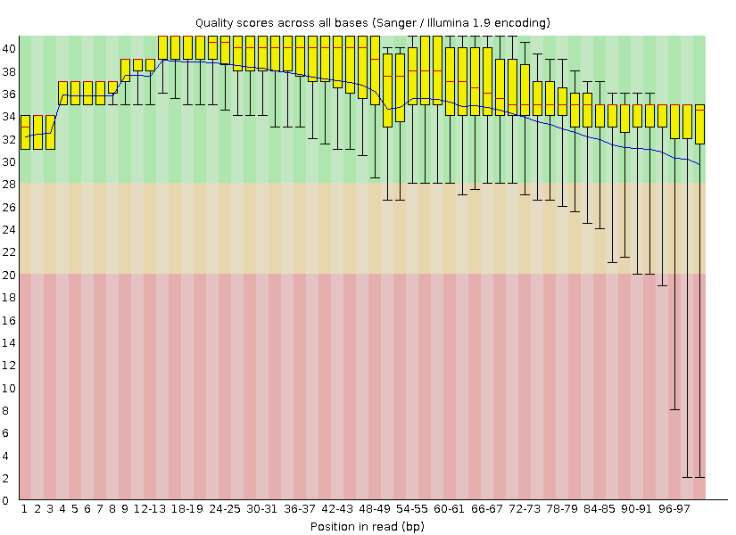

# Trimming Raw Reads Worksheet

<!--- Write name below --->
## Name: Reagan McKee

<!--- For this worksheet, answer the following questions--->

## Q1: What does "cleaning" your reads mean?
Answer: Removeing position and reads with low quality and removing the adapter sequences

### Q2: Open the script called "trim_raw_reads.sh". For every line that says ```insert description here```, replace that text with a description of what the line will do

### Q4: Attach an image of the plot from fastqc showing the average base quality from your reads files



---

## The following questions pertain to your first fastp run (without altering the parameters)
### Q5: How many reads were there in the R1 file before filtering?
Answer: 33967298 sequences
### Q6: How many bases were there in the R1 file before filtering?
Answer: 101 in each sequence
### Q7: What proportion of bases were above PHRED score of 20 before filtering?
Answer: All of them 
### Q8: What proportion of bases were above PHRED score of 30 before filtering?
Answer: Almost all of them

### Q13: How many reads were there in the R2 file before filtering?
Answer: 33967298 sequences
### Q14: How many bases were there in the R2 file before filtering?
Answer: 101 
### Q15: What proportion of bases were above PHRED score of 20 before filtering?
Answer: All
### Q16: What proportion of bases were above PHRED score of 30 before filtering?
Answer: All

### Q17: How many reads were there in the merged file after filtering?
Answer: 12083667 sequences 
### Q18: How many bases were there in the merged file after filtering?
Answer: 	15-171 per sequence
### Q19: What proportion of bases in the merged file were above PHRED score of 20 after filtering?
Answer: All
### Q20: What proportion of bases in the merged file were above PHRED score of 30 after filtering?
Answer: All

### Q21: What is the difference between the merged and unmerged files (in principle, not quantitatively)?
Answer: 
### Q22: Why are the unmerged files for R1 and R2 different lengths?
Answer:

---

## The following questions pertain to Remix 1 (the first time you change fastp parameters)
### Q23: What parameters did you change?
Answer: -M from 20 to 25
### Q24: How did you expect this to change the filtering results (be specific)?
Answer: Not very much because most of the bases already had a phred score > 25
### Q25: Explain the results. Did the change cause an effect that matched your expectations? Use information from the fastp output to explain.
Answer: 

---

## The following questions pertain to Remix 2 (the first time you change fastp parameters)
### Q26: What parameters did you change?
Answer: 
### Q27: How did you expect this to change the filtering results (be specific)?
Answer: 
### Q28: Explain the results. Did the change cause an effect that matched your expectations? Use information from the fastp output to explain.
Answer: 

